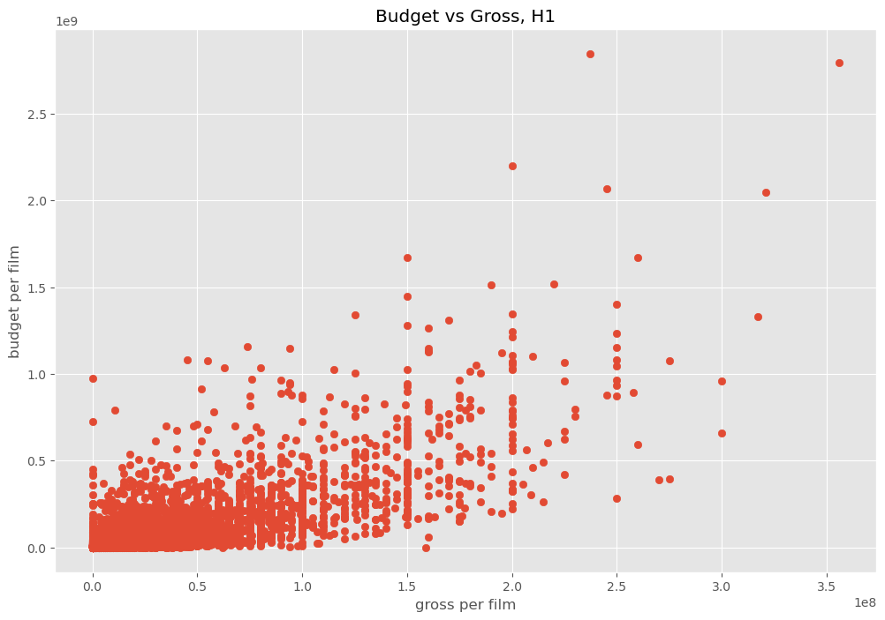
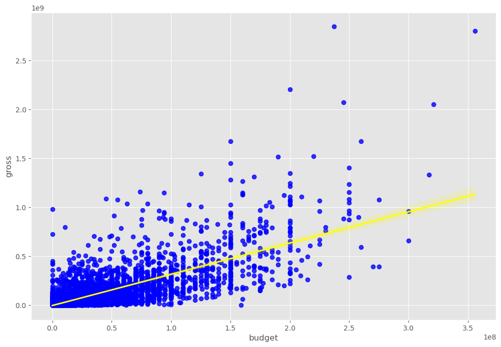
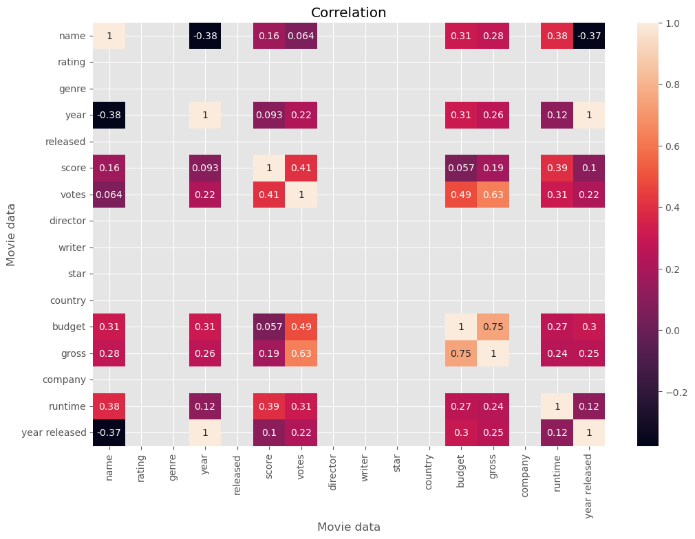
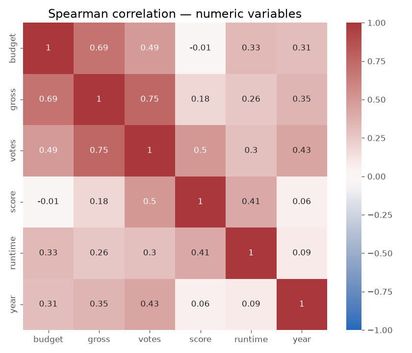
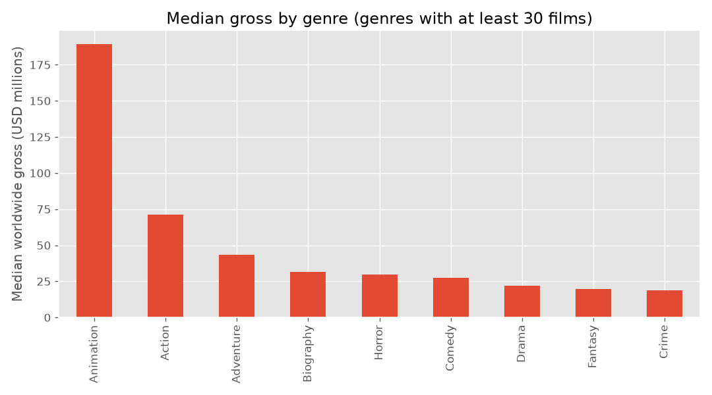
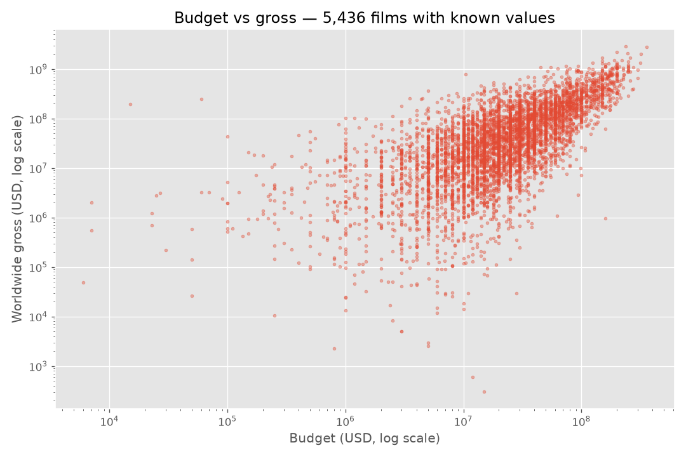

# Movie Industry Correlation Analysis with Python

A Jupyter notebook that cleans a dataset of about 7,700 films and explores which numeric variables move together with box-office gross. It uses pandas, seaborn and matplotlib.

> **Guided learning project.** This notebook follows the *Data Analyst Portfolio Project* series by
> [Alex The Analyst](https://github.com/AlexTheAnalyst/PortfolioProjects) ("Movie Portfolio Project").
> The import cell and overall flow come from the course. I wrote my own version of several steps, such as the release-year extraction function and the missing-value loop.

## Context

This was my first end-to-end analysis in Python: loading a CSV, checking data quality, fixing data types, and using correlation to form and test a simple hypothesis.

## Question

**Which film attributes are most strongly correlated with gross revenue?** The working hypothesis in the notebook (labelled *H1*) is that budget is strongly related to gross.

## Technologies

- Python 3.12 (recorded in the notebook metadata)
- pandas, NumPy
- matplotlib, seaborn
- Jupyter Notebook

## Dataset and source

| Item | Detail |
|---|---|
| Dataset | **[Movie Industry](https://www.kaggle.com/datasets/danielgrijalvas/movies)** by Daniel Grijalva on Kaggle. License: **CC0: Public Domain** (as listed on Kaggle). |
| How the source was confirmed | The notebook loads `movies.csv` with the same columns as that dataset (`name, rating, genre, year, released, score, votes, director, writer, star, country, budget, gross, company, runtime`). Its saved missing-value ratios correspond to exactly 77, 2,171, 189 and 17 missing values out of **7,668 rows**, which is the size of that dataset's `movies.csv`. The course uses the same Kaggle dataset. |
| Included in this repo | **No.** Download `movies.csv` from Kaggle and place it next to the notebook. |

## Methodology

1. **Load** `movies.csv` and inspect the first rows.
2. **Missing values:** calculate the share of nulls per column. `budget` is missing for about 28% of films and `gross` for about 2.5%.
3. **Treat missing values:** fill all nulls with `0` (`df.fillna(0)`).
4. **Fix data types:** cast `budget` and `gross` to `int64`.
5. **Feature extraction:** a custom `extract_year()` function parses the release year from the `released` text column into a new `year released` column.
6. **Explore:** sort by gross, then plot budget against gross as a scatter plot and a regression plot.
7. **Correlation:** build a Pearson correlation matrix of the numeric columns and plot it as a heatmap.
8. **Encode categoricals:** convert text columns to category codes, recalculate the full correlation matrix, unstack it into pairs, sort them and filter for correlations above 0.5.

## Results observed in the notebook

All values below are taken from the outputs saved in the notebook. The notebook was **not** re-run for this documentation.

| Pair | Pearson r |
|---|---|
| budget ↔ gross | **0.750** |
| votes ↔ gross | **0.633** |
| votes ↔ budget | 0.487 |
| score ↔ votes | 0.407 |

- In this dataset, **budget** and **number of votes** are the variables most strongly correlated with gross, which supports *H1*.
- The final comment in the notebook says *"votes and budget have the highest correlation"*. Read it as *"votes and budget are the variables most correlated **with gross**"*; the correlation between votes and budget themselves is 0.487.
- Correlation does not imply causation.

### Charts saved in the notebook

These images were extracted directly from the notebook outputs. They were not regenerated.

| Budget vs gross (scatter) | Budget vs gross (regression) |
|---|---|
|  |  |



## v2: revised analysis (October 2026)

[`movie-correlation-analysis-v2.ipynb`](movie-correlation-analysis-v2.ipynb) revisits the original notebook and fixes the issues listed under *Limitations*:

- missing values are handled with complete cases instead of filling them with 0;
- Pearson is compared with Spearman correlation;
- the axes are labelled correctly, with log scales for money;
- text columns are compared as groups instead of being correlated as category codes.

It was executed end to end on the official Kaggle file. That file is identical to the one used in v1: same 7,668 rows, same missing-value counts, and the v1 method reproduces 0.750157 exactly.

| Method | budget ↔ gross | votes ↔ gross |
|---|---|---|
| v1: Pearson, missing filled with 0 | 0.750 | 0.633 |
| v2: Pearson, complete cases (5,436 films) | 0.740 | 0.615 |
| v2: **Spearman**, complete cases | 0.694 | **0.746** |

**What changed:** with rank-based correlation, **votes** are more associated with gross than budget is. Pearson had placed budget first because a few blockbusters dominate it. Among genres with at least 30 films, **Animation** has the highest median gross (≈ USD 189 M), followed by Action (≈ USD 71 M). All of these are associations, not causes.

| Spearman correlation | Median gross by genre |
|---|---|
|  |  |



## Repository structure

```
.
├── MovieCorrelationProject4.ipynb        # Original guided notebook (unchanged)
├── movie-correlation-analysis-v2.ipynb   # Revised analysis (executed, outputs saved)
├── images/                               # v1 charts extracted from the original notebook
│   └── v2/                               # Charts produced by the v2 notebook
├── requirements.txt
└── README.md
```

## How to run

```bash
pip install -r requirements.txt
# download movies.csv from Kaggle (see "Dataset and source") into this folder
jupyter notebook movie-correlation-analysis-v2.ipynb   # revised analysis
jupyter notebook MovieCorrelationProject4.ipynb       # original guided notebook
```

The Kaggle download link in *Dataset and source* gives `movies.csv`. It is listed in `.gitignore` and not committed.

## Limitations of the original notebook (v1)

The v2 notebook addresses these points.


- **Missing budgets are filled with 0.** About 28% of films therefore have a budget of 0, which distorts the budget correlations. Dropping or imputing those rows would be more appropriate.
- The missing-value loop prints *fractions* (for example `0.283`) followed by a `%` sign. The actual share is 28.3%.
- In the scatter plot cell, the axis labels are swapped: the x-axis shows budget and the y-axis shows gross.
- Correlating **category codes** (for example `genre`, `director`) is not statistically meaningful, because the codes are arbitrary.
- The second heatmap cell plots the encoded data values themselves, not a correlation matrix, despite its title. That chart is not reproduced here.
- No statistical significance testing or modelling was done.

## Next steps

- Adjust monetary values for inflation before comparing films across decades.
- Add a simple regression model with validation to quantify the drivers of gross.

## Credits

- Course and notebook structure: [Alex The Analyst – PortfolioProjects](https://github.com/AlexTheAnalyst/PortfolioProjects).
- Data: [Movie Industry – Daniel Grijalva (Kaggle, CC0)](https://www.kaggle.com/datasets/danielgrijalvas/movies).

## Contact

**Kevin Espinoza**, Civil Engineer transitioning into Data Analytics and Automation
GitHub: [@kevinEspinozaTech](https://github.com/kevinEspinozaTech) · Email: [k.espinozano@gmail.com](mailto:k.espinozano@gmail.com)
